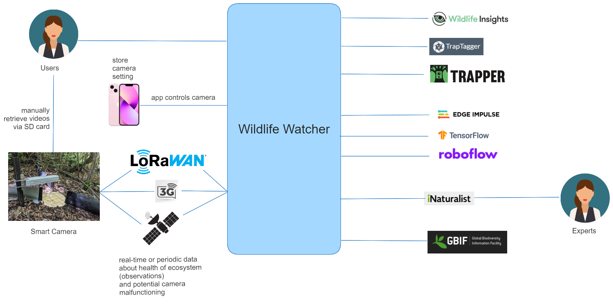
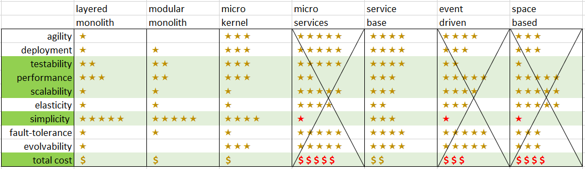

# Analysis

## Overview

## Architectural Characteristics

Many of our ADRs deal with the architectural 
characteristics (ADR 000-013, 017). We selected the following characteristics:

. cost
. performance (reasonable performance)
. scalability (long term scalability)
. extensibility
. simplicity
. testability
. interoperability

We also considered maintainability. 

## Architecture Decision 

In ADR 014 we picked the compromise of 
a service-based architecture.

## Actor / Actions

We used the actor/action approach to break down the domain. We 
added 3 other actors, but they are only used in very few 
use cases.

### Staff

. Initialize Camera for shipping
. Create camera inventory records

We added the role of staff who will be needed to
facilitate the registration and capabilities of the 
cameras using the system making sure the serial numbers
are correct before shipping.

### User

. Register User
. Register Camera
. Authenticate
. Turn Camera On/Off (using app)
. Change Camera Settings (using app)
. Set Camera location
. Create Workspace
. Change security for Workspace
. Assign content to Workspace
. Download Video from Camera (offline)
. Upload Video
. Select Video for Labeling with criteria
. Select Video for Training with criteria
. Download Training Model
. Share Video 
. Import Shared Video from other user
. Import Shared Training data
. Select best frame from video for Expert
. Review reports for own videos
. Review reports for geographic region

We added the concept of Workspaces which is 
like a Project and often the container for the 
training. 

### Camera

. Send periodic occurance
. Send immediate occurance
. Send camera health alert
 
With better connectivity and capabilties,
the Smart Camera will be able to do more 
functions like uploading videos that require
manual handling at the moment.
 
 
### Expert system

. Receive species identification from expert

The expert will be using the iNaturalist 
platform. The Wildlife Watcher will receive a 
notification, when an expert responds to
the request for identification.

## Platform costs

Before we offer third party tool / platforms, it is good to 
look at potential fees. We didn't see any reason to exclude one
particular platform.

Wildlife Insights, TrapTagger and Trapper are Open Source.

### roboflow

Free for research

### Edge Impulse 

Free Community edition for  students, universities, and individual developers at companies with less than 15 employee.

### TensorFlow

Free / open-source
