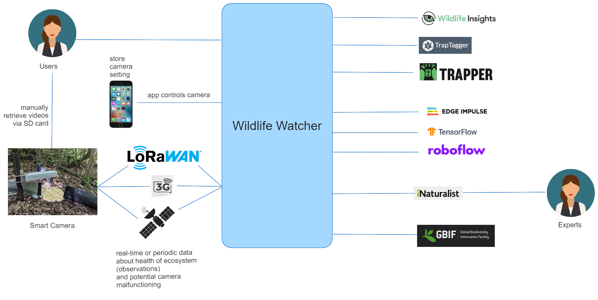

# Analysis

## Overview

## Architectural Characteristics

Many of our ADRs deal with the architectural 
characteristics (ADR 001-013). We selected the following characteristics:

. cost
. performance (reasonable performance)
. scalability (long term scalability)
. extensibility
. simplicity
. testability
. interoperability

## Architecture Decision 

In ADR 014 we picked the compromise of 
a service-based architecture.

image::../images/characteristics.png[]

## Actor / Actions

### Staff

. Initialize Camera for shipping

### User

. Register User
. Register Camera
. Authenticate
. Turn Camera On/Off (using app)
. Change Camera Settings (using app)
. Set Camera location
. Create Workspace
. Change security for Workspace
. Assign content to Workspace
. Download Video from Camera (offline)
. Upload Video
. Select Video for Labeling
. Select Video for Training
. Download Training Model
. Share Video 
. Import Shared Video from other user
. Import Shared Training data
. Select best frame from video for Expert

### Camera

. Send periodic occurance
. Send immediate occurance
. Send camera health alert
 
### Expert system

. Receive species identification from expert

## Platform costs

### roboflow

Free for research

### Edge Impulse 

Free Community edition for  students, universities, and individual developers at companies with less than 15 employee.

### TensorFlow

Free / open-source
