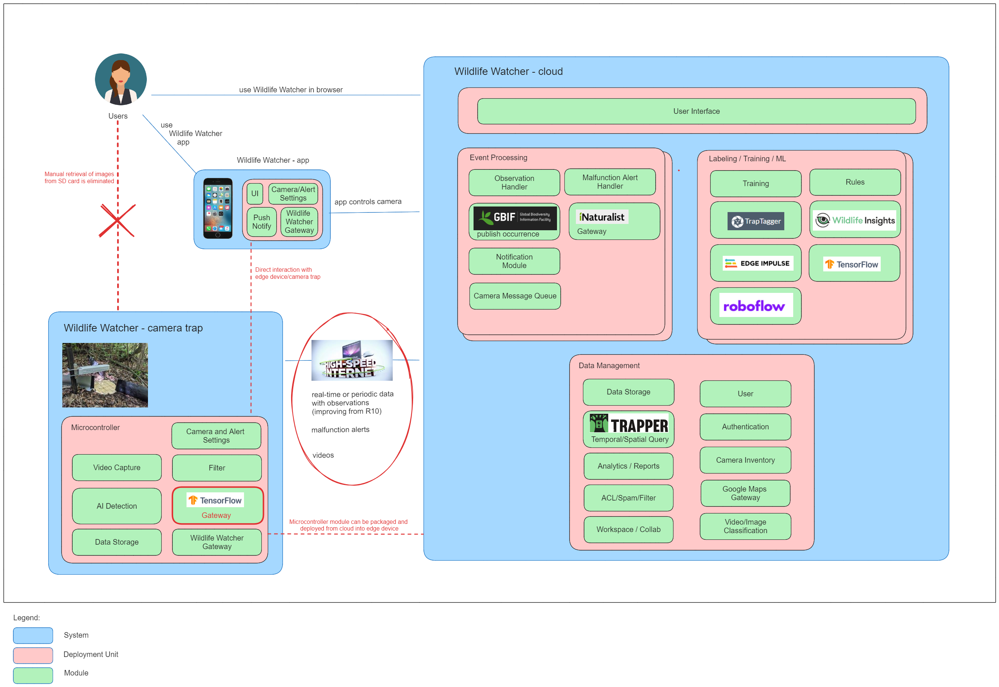

# Solution

## Standard Scenario: Weak internet  connectivity 

LoRaWAN has a transfer rate of 250 bits/s up to 22 kilobits/s.
A 1KB message can take several seconds.

### Video size

The video size depends on the resolution, the color depth, the frame rate and the length.

1280x720 pixel with 8bit color depth would be 1280x720x(3x8) = 22,118,400 bit = 2,764,800 bytes = 2.64 MB per frame. Assuming the standard framerate of 24 frames/s and a 5-10 second clip, the video would be between 316MB and 633MB. Compression like H.264 will bring the clip size down to about 31 MB for a 5s video. This is still too much for LoRaWAN and the user needs to manually download the videos from the SD card in the camera. 

### Alerts 

LoRaWAN allows to send emails. Adding a carrier's Email-to-Text gateway would be a very simple solution for alerts. Having a central handling of alerts and observations, allows escalation procedures and tracking & submission to iNaturalist. This is way we suggest this centralized solution.

image::../images/the-architecture-lorawan.png[]

### Service-based Architecture

"Wildlife Watcher - cloud" is structured as service-based architecture. 
This gives Wildlife.ai a quick start while keeping costs low and maintainability high.
This architecture belongs to the category of distributed architectures.
It is necessary to divide our domain.
We have a coarse-grained partitioning into 4 units:

. User Interface
. Event Processing: alerts and notifications
. Labeling / Training / ML: gateways to varied internal and external platforms
. Data Management: data storage, filtering and spacial queries; we added here camera & user   
registration and authentication

Each of these unit contain multiple modules. The training and event processing are probably 
the first parts that require scalability in the future when the number of users or the number of camera per user increases. The service-based architecture allows growth without big expenses or high complexity. Performance and Scalability were our top system characteristics right after the costs.
Additionally, this service-based architecture allows moving single modules into a microservice
for example if the Notification Module need Elasticity.

### Smart Camera

The design goal for the microcontroller is to filter out as much of the false positive detections as possible. External
influences like wind should be eliminated as early as possible in the process to avoid unnecessary videos clogging our system.

## Possible opportunity in the future: Strong internet connectivity

Faster internet connections like satelite-based Starlink would allow 
video upload in the future even in remote areas. This would allow new use cases where the training could start on the module deployed on a micro-controller/edge device but most of the work can be done remotely. 
However, power consumption and cost might limit the use. 

The diagram is the same with the modifications circled in red.

## Verify the solution with dynamic processes

### Video Upload

We assume that we have an authenticated user already. The goal is to upload a video and expect the system to check for spam etc. We also expect that the system will organize the content.

image::../images/seq_upload.png[]

### Training 

Training usually happens with a set of videos that were previously prepared ("labeled"). Training is a repetitive process (loop) that stopps when the model reached certain quality threshold. The diagram shows a recursive process. That is the reason the "Labeling / Training / ML" unit  

### Turn on camera

Turning the camera on means activate the camera for species detection. The user will use the phone app which will connect to the backend system which will try to reach the camera.

