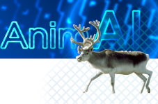

# AnimAI

Team AnimAI is a group of 4 people - two ladies and two gentlemen. Three of them work together at the same company in Canada. The fourth friend worked with one of them at the Toastmasters District leadership team in British Columbia and joined the group from China.

The picture shows a Peary Caribou - one of the endangered species in Canada.    

## Table of contents

link:1-Requirements/[1. Requirements]

link:2-Analysis/[2. Analysis]

link:ADRs/[ADRs]

    